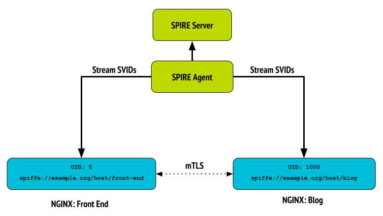

# spiffe-nginx Demo

This demo shows nginx working with the SPIFFE Workload API to get SVIDs in order to perform mTLS between two nginx servers.

The scenario simulates the presence of a front-end server proxying the connections to a blog service.



nginx has been modified to be able to automatically get SPIFFE certificates using the Workload API and accept or reject connections based on the SPIFFE ID of the certificates. Certificates are received as they are available, and they are reloaded automatically without user intervention.

A new set of configuration directives has been added. They must be placed under the `server` block.
```
    ssl_spiffe_sock       /tmp/agent.sock;                  # Socket path of SPIRE Agent
    svid_file_path        /certs/front_end_svid.pem;        # File path to store SVID in PEM format
    svid_key_file_path    /certs/front_end_svid_key.pem;    # File path to store SVID Private Key in PEM format
    svid_bundle_file_path /certs/front_end_svid_bundle.pem; # File path to store SVID Bundle (CA certificates belonging to the Trust Domain) in PEM format
```

The following directives are used to control the acceptance of connections based on the SPIFFE ID:
```
    ssl_spiffe on;                                          # Enable or disable validation of SPIFFE ID
    ssl_spiffe_accept spiffe://example.org/host/front-end;  # List of SPIFFE IDs to accept
```

When the server is proxying connections to another server, the following directives are used for the SPIFFE ID validation:
```
    proxy_ssl_spiffe on;
    proxy_ssl_spiffe_accept spiffe://example.org/host/blog;
```

## Example configuration files

- [nginx_fe.conf](spiffe-nginx/configurations/nginx_fe.conf)
- [nginx_blog.conf](spiffe-nginx/configurations/nginx_blog.conf)

## Running the demo

1. Run `make`. This builds the docker image.

2. Run `make demo`. This will show four terminals, named `0 spire-server`, `1 spire-agent`, `2 nginx-blog` and `3 nginx-fe`.
- `0 spire-server` can be used to launch `spire-server`.
- `1 spire-agent` can be used to create the registration entries and launch `spire-agent`.
- `2 nginx-blog` can be used to launch nginx as the nginx-blog user using the [nginx_blog.conf](spiffe-nginx/configurations/nginx_blog.conf) configuration file. This can be done running `su -c "./nginx -c /usr/local/nginx/nginx_blog.conf” nginx-blog`.
- `3 nginx-fe` can be used to launch nginx as root using the [nginx_fe.conf](spiffe-nginx/configurations/nginx_fe.conf) configuration file. This can be done running `./nginx /usr/local/nginx/nginx_fe.conf`.